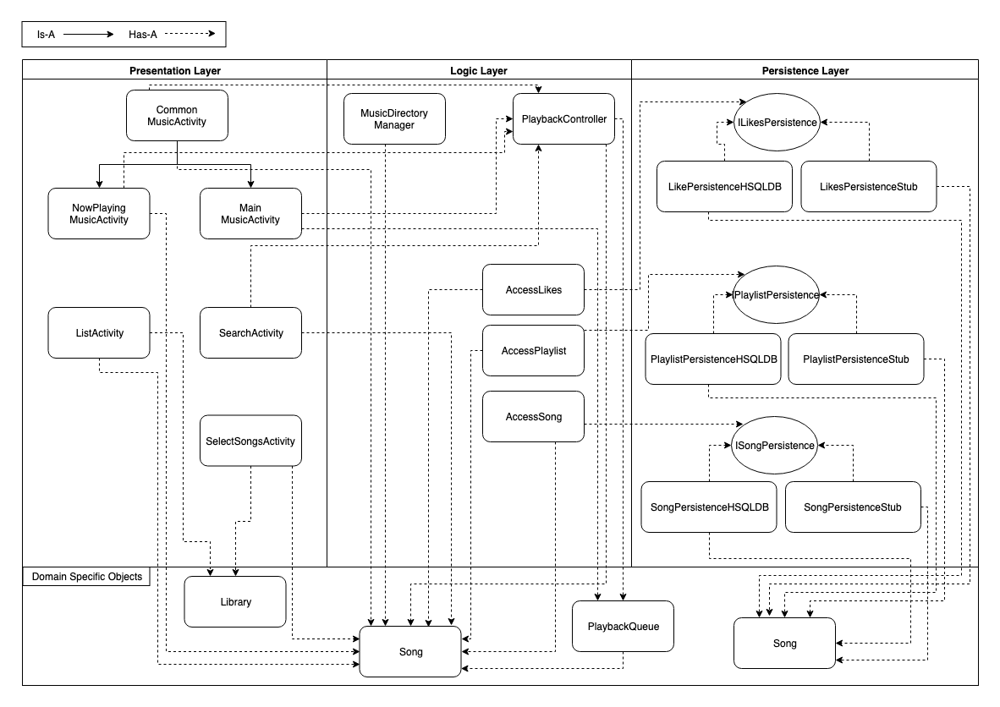

# Application Architecture

## Table of Contents

* 1 - [Introduction](ARCHITECTURE.md/#introduction)
* 2 - [Presentation Layer](ARCHITECTURE.md/#presentation-layer)
* 3 - [Logic Layer](ARCHITECTURE.md/#logic-layer)
* 4 - [Persistence Layer](ARCHITECTURE.md/#persistence-layer)
* 5 - [Domain Specific Objects](ARCHITECTURE.md/#domain-specific-objects)
* 6 - [Other](ARCHITECTURE.md/#other)
* 7 - [Diagram](ARCHITECTURE.md/#diagram)

## Introduction

Broadly, Wave Music (henceforth referred to as "the app") consists of the main source package and a test package. The test package contains one file for each testable class in the main package. The app follows a three-tier architecture with presentation, logic and persistence layers. These layers are represented as collections of classes in the main package, as described in this document.

##Application

* **ActivityController:** Handles settings and populating the correct activities for the app when a corresponding action occurs that requires a new activity.
* **PermissionManager:** Responsible for setting the correct system permissions to allow access to the device's file structure.
* **SampleAssetManager:** Responsible for reading the sample music files from the project's assets folder when the app launches.
* **Services:** Allows classes to get an instance of the Database.
* **SwipeDismissListViewTouchListener:** A third-party class used to implement the 'swipe-to-remove' action for removing a song from the library.

## Presentation Layer

The presentation layer is implemented through the app's activities. All of these activities are responsible for displaying information to the user in some form. All activities are listed below:

* **NowPlayingMusicActivity:** Displays which song is currently playing, as well as the controls to modify the playback of the song (pause, resume, skip).
* **CommonMusicActivity:** Contains the music control buttons that are shared between other activities.
* **MainMusicActivity:** Controls the navigation and playback of songs in the music library.
* **LaunchActivity:** Initiates the database setup and building of the song library.
* **SearchActivity:** Enables searching for songs, albums, and artists.
* **SinglePlaylistActivity:** A view for a single playlist.
* **SelectSongsActivity:** A view for multi-selecting songs to add to a playlist.

## Logic Layer

There are several classes defined to handle business logic; they are "presentation layer facing" classes which act as callable interfaces for the presentation layer. This group consists of the following classes:

* **AccessLikes/AccessPlaylist/AccessSong:**
* **MusicDirectoryManager:** Provides the functionality to do all necessary reading of music files from the disk. This includes importing of music from various directories defined by the user.
* **PlaybackController:** Responsible for implementing interfaces for all necessary playback functionality. This includes starting a song, skipping forwards, skipping backwards, tracking to a specific position, pausing and resuming playback.

## Persistence Layer

The persistence layer is defined abstractly by the `IDatabaseController` interface and then implemented by the `DatabaseStub` class.

* **LikePersistenceStub/PlaylistPersistenceStub/SongPersistenceStub:** Responsible for storing the library of songs as well as querying the library of songs with a variety of different search parameters (song name, artist name, album name, etc.).
* **LikePersistenceHSQLDB/PlaylistPersistenceHSQLDB/SongPersistenceHSQLDB:**

## Objects

There are also several domain objects that are used throughout the hierarchy.

* **Song:** An object for each song in the library. It contains information about the song such as the song's name, artist, album, and location on disk.
* **Library:** 
* **PlaybackQueue:** A list of upcoming songs to be played. The contents of this list depend on which group of songs was selected to be played. For example, a whole artist, album, or playlist.

## Other

The application package contains classes that are required for the basic operation of the application but do not belong in the traditional 3-tiered architecture.

## Diagram

