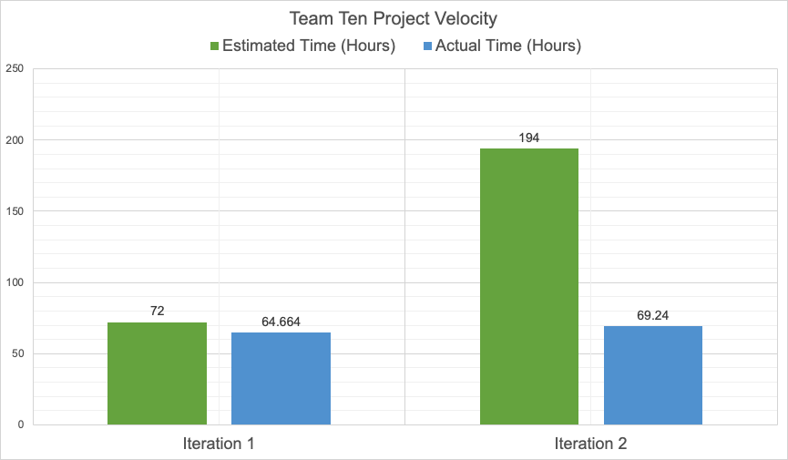

# Retrospective

One part of our project that has not been as successful as we would have liked in the user interface (UI) design. The UI works and is fully functional but the elements are not organized and placed on the display in a visually appealing way. Currently, the volume slider is far too small to be easily used by the user and is placed near the centre of the display, causing the user to have to reach farther to select the button.

We can improve the UI by deciding on new locations on the display for each button, making sure we optimize element placement for ease-of-use of the user while keeping the layout visually appealing.

* Music control bar: To improve this UI element we can centre it horizontally at the bottom of the app so that every button is equally as easy to reach instead of favouring specific buttons.
* 'Like' button: To improve this button we can make it slightly larger and move it to the bottom left or right of the display, directly above the music controls.
* Shuffle toggle button: To improve this button we can make it slightly larger and move it to the bottom area of the display so that it is more apparent to the user.
* Volume Slider: The volume slider can be improved by making it a lot bigger and moving it to the bottom of the display, directly above the music controls. This will allow users to adjust the volume of the currently playing some much easier without needing to be very precise.
* Song Information: At the now playing music view the only song information that is displayed is the song's name. Most people will want more information about the song than this. To improve this we will display the song's name along with the artist, album, and genre. This information will be displayed somewhere in the centre of the display at a large enough font size to be easily legible.

The success of these improvements will be measured by completing user tests that determine if the UI element under testing is both visually appealing, easy to understand its function, and easy to use (physically). The success criteria for these tests will be that at least 90% of users have a positive response for each individual test. For example, nine out of ten users that test for visual quality suggest that the element is visually appealing. These tests will be done by giving each user a very basic set of instructions to complete within the app. We will then record their performance and compare to each features performance to the other users that tested.

## Project Velocity

